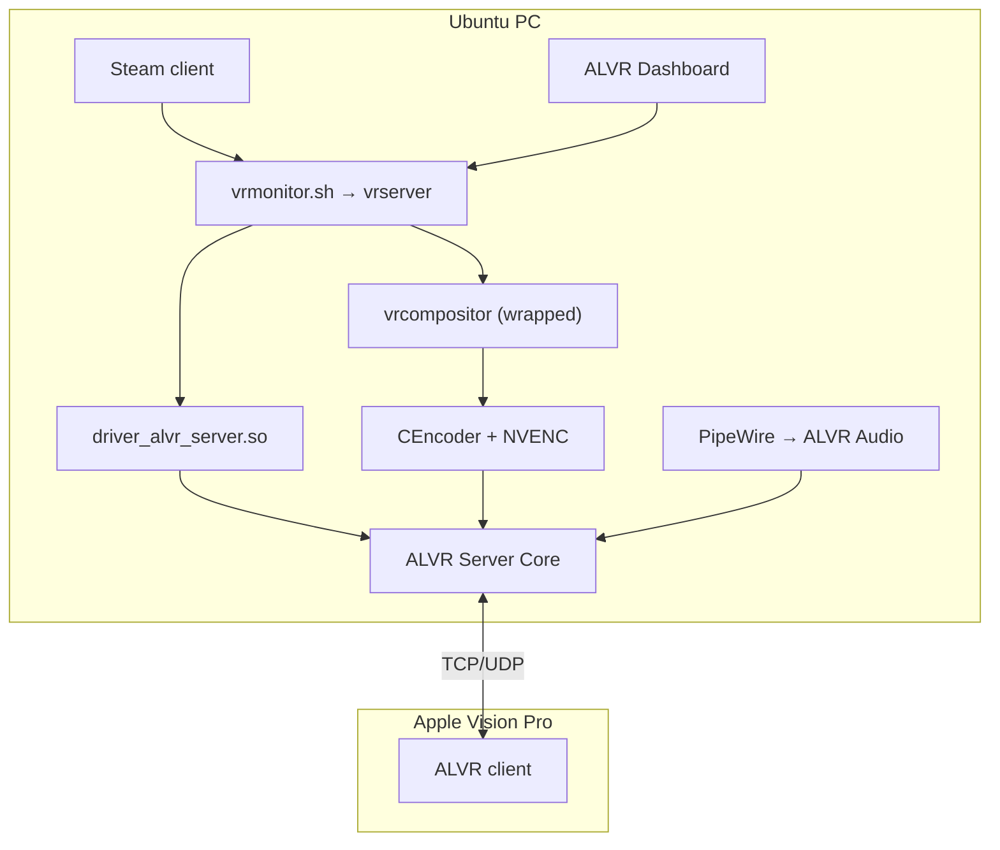
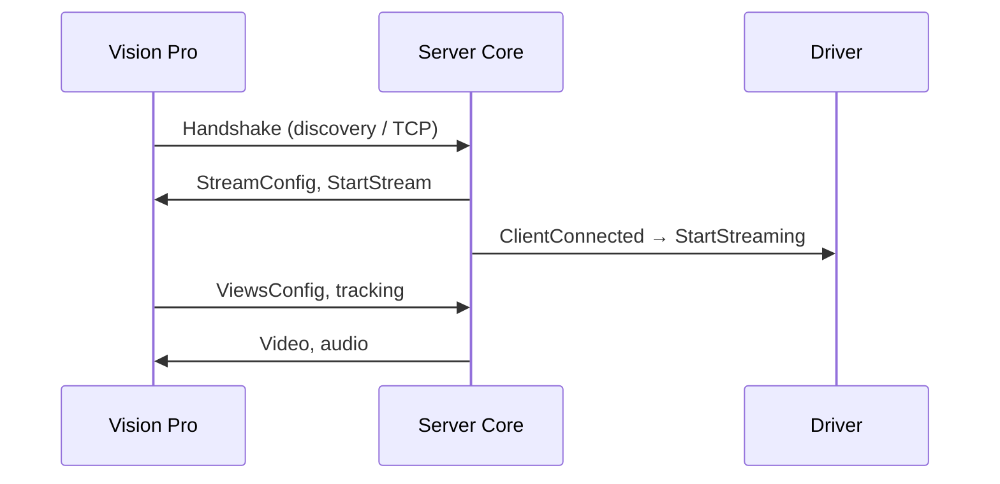

# ALVR + SteamVR + Steam on Linux (Apple Vision Pro)

Architecture reference for the Tensorbook / Ubuntu 24 / RTX 3080 / SteamVR 2.12.14 stack.

## Big picture

ALVR is an **OpenVR server driver** — not a SteamVR replacement. SteamVR thinks a headset is plugged in; display and tracking run on the Vision Pro over the network.



| Component | Role |
|-----------|------|
| **Steam** | Games + SteamVR (App ID **250820**). GPU env via launch options. |
| **ALVR Dashboard** | UI, `session.json`, driver registration, SteamVR launch. |
| **vrmonitor** | Linux SteamVR entry; starts `vrserver` + `vrcompositor`. |
| **vrserver** | OpenVR runtime; loads drivers, tracking graph. |
| **vrcompositor** | Renders VR scene to the HMD display. |
| **ALVR driver** | Registers HMD/controllers; bridges to Server Core. |
| **Server Core** | Network, handshake, bitrate (Rust, inside driver process). |
| **Vision Pro client** | Decode video, send poses, play audio. |

## SteamVR startup and `%command%`

Steam runs **`vrmonitor.sh`**, not `vrserver` directly. In Launch Options, `%command%` is replaced by Steam’s real command.

**Hybrid NVIDIA laptop (example):**

```bash
__GLX_VENDOR_LIBRARY_NAME=nvidia __NV_PRIME_RENDER_OFFLOAD=1 VK_DRIVER_FILES=/usr/share/vulkan/icd.d/nvidia_icd.json \
  ~/.local/share/Steam/steamapps/common/SteamVR/bin/linux64/vrmonitor.sh %command%
```

**Games (same GPU pinning):**

```bash
__GLX_VENDOR_LIBRARY_NAME=nvidia __NV_PRIME_RENDER_OFFLOAD=1 VK_DRIVER_FILES=/usr/share/vulkan/icd.d/nvidia_icd.json %command%
```

Single-GPU desktop may only need:

```bash
~/.local/share/Steam/steamapps/common/SteamVR/bin/linux64/vrmonitor.sh %command%
```

### Launch sequence

1. Dashboard registers driver → `~/.config/openvr/openvrpaths.vrpath`
2. Dashboard symlinks `vrcompositor` → ALVR wrapper
3. Dashboard unblocks `driver_alvr_server` in `steamvr.vrsettings`
4. `steam steam://rungameid/250820`
5. `vrmonitor.sh` → `vrserver` + `vrcompositor`
6. `vrserver` loads `driver_alvr_server.so` → `HmdDriverFactory()`

## Driver loading

### Registration

`~/.config/openvr/openvrpaths.vrpath`:

```json
{
  "runtime": ["~/.local/share/Steam/steamapps/common/SteamVR"],
  "external_drivers": [
    "~/.local/share/ALVR-Launcher/installations/v20.14.1/alvr_streamer_linux/lib64/alvr/bin/linux64"
  ]
}
```

### Manifest (`driver.vrdrivermanifest`)

- `alwaysActivate: true` — load without USB headset
- `redirectsDisplay: true` — driver owns HMD display
- `name: alvr_server`

### Entry point

`HmdDriverFactory()` in `driver_alvr_server.so`:

1. Verifies `alvr_dashboard` matches this install
2. Reads `~/.config/alvr/session.json`
3. Starts Server Core (handshake, web UI `:8082`)
4. Registers HMD with SteamVR (`IVRDisplayComponent_002` on this stack)

## Video path on Linux

Linux has no Direct Mode for software HMDs. ALVR fakes a Vulkan display via **VK_LAYER_ALVR_capture**.


### vrcompositor wrapper

```
SteamVR/bin/linux64/vrcompositor → .../libexec/alvr/vrcompositor-wrapper
SteamVR/bin/linux64/vrcompositor.real → real binary
```

Wrapper sets Vulkan layer env, disables MangoHud/vkBasalt, then `execvp("vrcompositor.real")`.

On **Wayland**: `LD_PRELOAD=alvr_drm_lease_shim.so`.

## X11 vs Wayland

| | X11 | Wayland |
|---|-----|---------|
| Games | GLX + PRIME vars | Often XWayland; Vulkan preferred |
| vrcompositor | Wrapper only | Wrapper + DRM lease shim |
| ALVR audio | PipeWire | PipeWire |

## NVIDIA / CUDA (RTX 3080)

- **Render**: Vulkan on GPU (compositor + games)
- **Encode**: FFmpeg `hevc_nvenc` / `h264_nvenc` via CEncoder
- **CUDA**: Build-time for FFmpeg NVENC (`sm_86`); runtime uses NVENC through libavcodec

## Connection flow



Discovery: UDP `WelcomeSocket` + trusted clients in `session.json`.

## Key paths

| Path | Purpose |
|------|---------|
| `~/.config/alvr/session.json` | ALVR settings |
| `~/.config/openvr/openvrpaths.vrpath` | Driver registration |
| `~/.local/share/Steam/config/steamvr.vrsettings` | SteamVR prefs |
| `.../installations/v20.14.1/alvr_streamer_linux/` | Streamer install |
| `$XDG_RUNTIME_DIR/alvr-ipc` | Compositor ↔ encoder |

See also: [README.md](./README.md) for restore steps and known-good settings.
