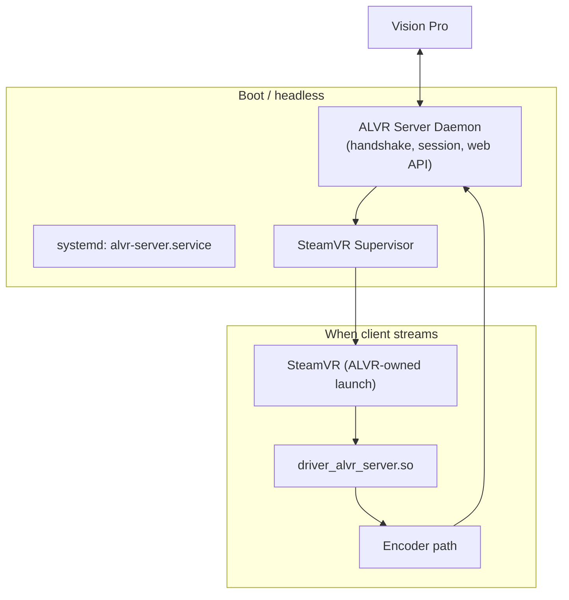

# Requirements: Touchless PC / Headless ALVR Server

Goal: use the Vision Pro from any room without touching the gaming PC. ALVR manages SteamVR, recovers from failures, and behaves like a natively attached headset where possible.

**Scope:** Server-side (dashboard, driver, supervisor) first. Client (visionOS) changes deferred.

---

## Target experience

1. PC boots → ALVR service starts (no monitor required).
2. Steam may run headless or on-demand; user never interacts with the PC.
3. Put on VP → open ALVR app → connected within seconds.
4. Lift headset, switch apps, exit VR, walk rooms → return without PC intervention.
5. Crashes (compositor, driver safe mode, SteamVR update) → ALVR detects and recovers automatically (bounded retries).

---

## Reference: native SteamVR headset behavior

### Wired Index / Vive (USB)

| Scenario | Expected behavior |
|----------|-------------------|
| **Headset on desk, SteamVR running** | Device stays **Connected**. Idle in SteamVR Home/void. |
| **Put on headset** | Proximity **true** → display active, resume where you left off. |
| **Lift headset (look at real world)** | Proximity **false** → display off/standby; **USB session intact**; game often pauses (game-dependent); **no reconnect**. |
| **Steam overlay → Exit VR** | Game exits VR mode → **SteamVR compositor stays up**; HMD still registered; launch another title from dashboard. |
| **Quit game from desktop** | SteamVR keeps running; HMD still there. |
| **Unplug USB** | Device **Disconnected**; must replug (physical reconnect). |

### Quest via Link / Air Link (Meta runtime → SteamVR)

| Scenario | Expected behavior |
|----------|-------------------|
| **Take off headset** | Link session often **persists**; standby; resume on wear. |
| **Leave Guardian / passthrough** | Runtime handles; PC Link not torn down. |
| **Switch to 2D Meta UI and back** | Usually **resume** without full PC reconnect. |
| **Exit VR in game** | Same as Index: back to SteamVR shell. |

### What “native” means for ALVR

Wireless + visionOS is harder than USB. The **PC-side contract** we can match:

- SteamVR stays running across **Exit VR**, brief idle, and **client reconnect**.
- HMD driver stays registered; no manual “Launch SteamVR” on PC.
- **Disconnect** only when the user explicitly quits streaming or the session is abandoned (long timeout).

---

## Scenario matrix: ALVR today vs target

| Scenario | Native wired | ALVR today | Target (server-only) | Needs client later |
|----------|--------------|------------|----------------------|-------------------|
| VP app open, first connect | N/A | Slow; needs SteamVR up | Handshake without SteamVR; supervisor starts VR on demand | Enter VR UI, faster IPD path |
| Lift headset, look around | Standby, no reconnect | TCP + encode may continue; no proximity | Keep session; optional pause encode when idle | Proximity → server pause/resume |
| visionOS notification → other app | N/A | App background; decode stops; server may still “Streaming” | Detect TCP idle/disconnect → **Linked** state; keep SteamVR warm | Foreground resume without full reconnect |
| Return to ALVR app | N/A | Often works if TCP alive; else reconnect | Auto-reconnect to warm server; supervisor ensures compositor healthy | Seamless resume UX |
| Steam menu **Exit VR** | Compositor up, HMD connected | Compositor crash; wireframes; double vision on relaunch | Supervisor restarts compositor/SteamVR; reset stream state; wait for client | Re-handshake ViewsConfig on resume |
| SteamVR crash / -203 | Rare; user replugs or restarts | Manual dashboard restart | Auto restart (≤2 attempts); unblock safe mode | Client retry connect |
| Walk to another room (WiFi) | N/A | May drop TCP; full reconnect | Discovery + reconnect; session preserved server-side | Roaming / mDNS |
| PC reboot | N/A | Nothing until manual launch | systemd autostart ALVR + supervisor | — |
| SteamVR auto-update | N/A | Stale vrcompositor.real | Pre-launch wrapper verify | — |

---

## Server architecture (target)



### Phase 1 — SteamVR supervisor (no protocol change)

**Owner:** dashboard or new `alvr-server` binary.

| ID | Requirement |
|----|-------------|
| S1 | Single component owns all SteamVR launches (no manual Steam UI). |
| S2 | Before launch: register driver, verify `openvrpaths.vrpath` points to **this** install, unblock safe mode, apply vrcompositor wrapper. |
| S3 | Launch via stored command line (GPU env + `vrmonitor.sh`), recorded at install/first-run. |
| S4 | Verify running `vrserver`/`vrcompositor` descend from **our** launch (pid tree or start time marker file in `$XDG_RUNTIME_DIR/alvr/`). |
| S5 | Health poll every N s: `pgrep vrserver`, `pgrep vrcompositor`, tail compositor log for `0.00%` warp mesh / `Fail (-203)`. |
| S6 | On failure while client connected: restart SteamVR (max **2** attempts, backoff); log event; restore driver registration after restart. |
| S7 | On SteamVR update: detect binary mtime change → re-apply wrapper before next launch. |
| S8 | Reject/alienate foreign SteamVR: if `vrserver` running but not our launch → stop and relaunch under supervisor. |

### Phase 2 — Control plane in daemon (handshake without SteamVR)

| ID | Requirement |
|----|-------------|
| C1 | Move `handshake_loop` + web server out of driver into **always-on daemon** (dashboard backend or standalone). |
| C2 | Client reaches **Connected** without SteamVR running (TCP/UDP control channel only). |
| C3 | Transition **Connected → Streaming** triggers supervisor to ensure SteamVR + compositor healthy, then driver loads and encoder starts. |
| C4 | Transition **Streaming → Connected** on compositor loss or graceful pause (stop encode/audio; keep control socket if possible). |
| C5 | Dashboard optional UI; daemon exposes `:8082` for status either way. |

### Phase 3 — Headless / touchless PC

| ID | Requirement |
|----|-------------|
| H1 | `systemd` user or system unit: start daemon at boot, restart on failure. |
| H2 | No requirement for X11/Wayland session for **streaming** (SteamVR still needs GPU + Vulkan; headless display via existing layer). |
| H3 | Document: auto-login user, Steam `-silent`, disable sleep on AC, wired Ethernet preferred for PC. |
| H4 | Optional: tray-less dashboard; all ops via VP + web UI from phone if needed. |
| H5 | Firewall: persist ALVR ports (9944, 8082, discovery UDP). |

### Phase 4 — Exit VR and reconnect hardening (mostly server)

| ID | Requirement |
|----|-------------|
| E1 | On compositor exit while TCP client alive: supervisor restart + **DeinitializeStreaming** + wait for client-driven reconnect (existing TCP may need reset — server closes gracefully). |
| E2 | Do **not** leave session in `Streaming` if `vrcompositor` absent >5 s. |
| E3 | After supervisor recovery: force **IDR** on next stream start; reset `m_deferLensDistortionChanged` via new `StartStreaming`. |
| E4 | Avoid mid-stream `ShutdownSteamvr()` except explicit user shutdown from dashboard/API. |

---

## Deferred (client / visionOS)

| ID | Requirement | Why client |
|----|-------------|------------|
| K1 | Proximity-driven pause/resume | Client sends wear state |
| K2 | Background → soft pause; foreground → resume without full handshake | iOS lifecycle |
| K3 | **Enter VR** vs **Connected** UI | App UX |
| K4 | Re-send `ViewsConfig` after server recovery | Client only sends on IPD change today |
| K5 | Fast reconnect / keepalive across WiFi roam | Client retry policy |

---

## SteamVR Home / lobby

Native headsets show SteamVR Home or void grid as the shell after Exit VR.

| Option | Server role |
|--------|-------------|
| Enable Home | Supervisor sets `enableHomeApp: true`; if Home crash loop → fall back to void + log |
| Void/grid only | Current stable default; supervisor ensures compositor shows **something** |

Recommendation: supervisor tries Home once per SteamVR launch; on repeated compositor crash within 30 s, set `enableHomeApp: false` and restart.

---

## SteamVR supervisor (implemented)

The dashboard and `alvr_server` binary run a background **SteamVR supervisor** that:

- Records ALVR-owned launches in `$XDG_RUNTIME_DIR/alvr/steamvr-launch.json`
- Polls `vrserver`, `vrcompositor`, and compositor logs every 3 s
- Recovers with **exponential backoff**: 5 s → 10 → 20 → … capped at **5 minutes**
- Resets backoff after a healthy check or manual restart
- Treats foreign `vrserver` (no launch marker) as recoverable

### Headless service

```bash
systemctl --user enable --now /path/to/scripts/known-good-steamvr-2.12/alvr-server.service
```

Or run directly:

```bash
~/.local/share/ALVR-Launcher/installations/v20.14.1/alvr_streamer_linux/bin/alvr_server
```

Set `open_close_steamvr_with_dashboard: true` in session for auto-launch on service start.


1. Boot PC, no input → within 2 min daemon listening, ports open.
2. From VP: connect while SteamVR was **not** pre-running → supervisor starts SteamVR; video within 60 s (until client optimizations).
3. **Exit VR** in Half-Life: Alyx → within 30 s compositor healthy again OR client sees disconnect and reconnects without PC touch.
4. Kill `vrcompositor` manually → supervisor restores within 2 attempts.
5. Trigger safe mode → next cycle unblocks driver and relaunches.
6. SteamVR update (simulate wrapper break) → next launch re-wraps successfully.

---

## Related docs

- [ARCHITECTURE.md](./ARCHITECTURE.md) — component diagram, driver load, Linux paths
- [README.md](./README.md) — known-good versions and restore
